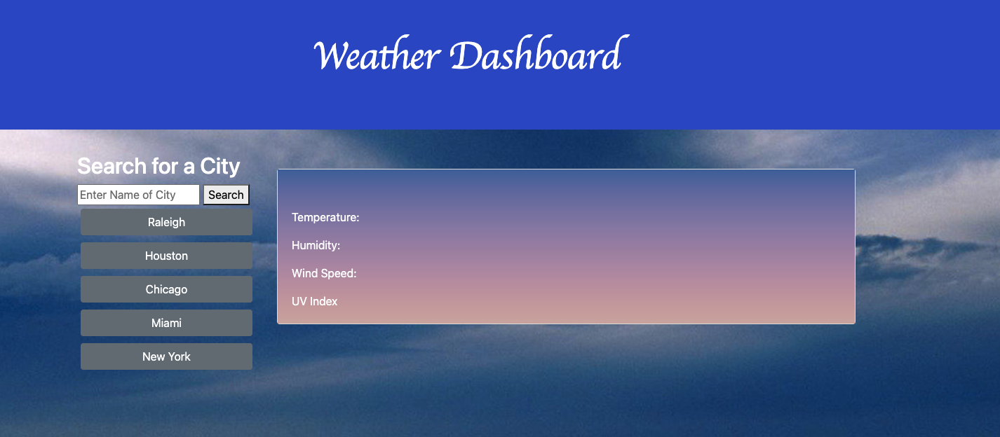
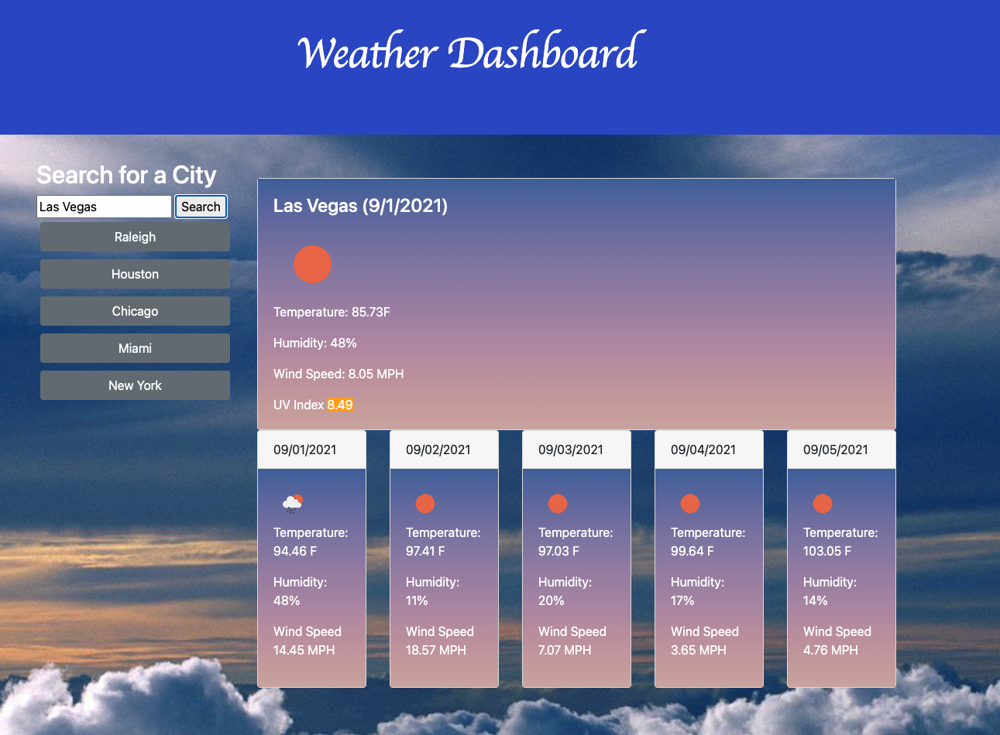
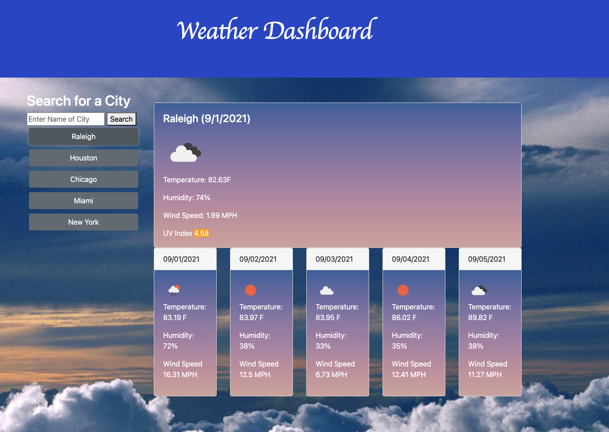
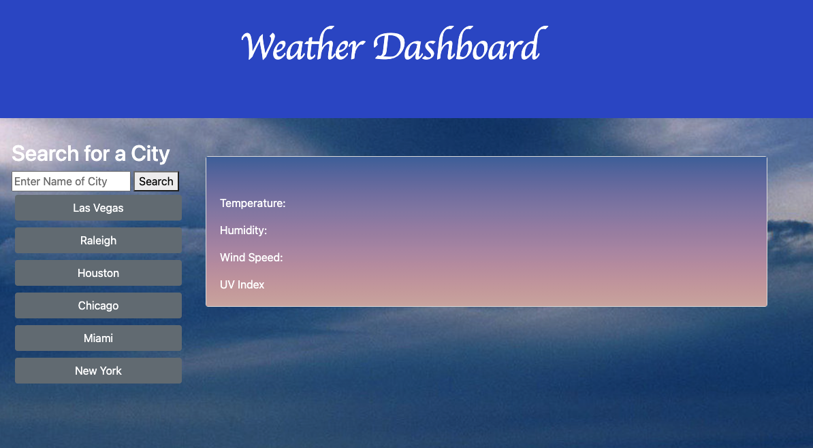

# Server-Side-APIs-Weather-Dashboard

## Description:

This application will get the local weather for a city that is chosen by the user. Once the user types in a city and presses the search button, the current weather will show, as well as, the 5 day forecast for that area. This search will also be added to local storage and if the user comes back to this site they will have a new button conveniently added so they do not have to retype the same city. 

---

## Table of Contents:

- [Technologies](#technologies)
- [Usage](#usage)
- [Testing](#testing)
- [License](#license)
- [Additional Info](#additional-info)

---

## Technologies: 

* Javascript
* CSS
* HTML
* Express
* Local Storage

---

## Usage:

This application will be used to help someone to figure out the local weather in their area. It is convenient to use, because buttons will show past searched cities. 

---

## Testing:

This project has no built in testing, but has been tested internally by the creator.

---

## License:

---

## Screenshots:

---

## Additional Info:
- Github: [bvanburenwx](https://github.com/bvanburenwx)
- Email: bvanburenwx@gmail.com
- Deployed Application: [GitHub Pages](https://bvanburenwx.github.io/Server-Side-APIs-Weather-Dashboard/)
